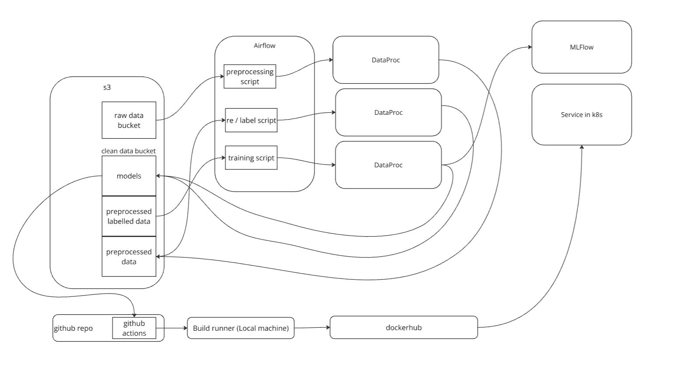

# Финальный проект по курсу Otus MLOps

## Тема: Классификация пользовательских обращений в техническую поддержку

Данные представляют собой неразмеченные пользовательские обращения в техническую поддержку.

Objective - разработать систему разметки + классификации заявок, приходящих в техническую поддержку.

## HLD
Основной пайплайн:

(п.1-3 оркестрируются в Airflow)

1. Препроцессинг данных с S3
2. Разметка данных
    * (автоматически) Разметка по предобученным моделям
    * (опционально) (полуавтоматически) Переобучение моделей разметки
3. Обучение классификатора, сохранение метрик и статтестов MLFlow
4. Обученная модель обернута в Fast API + Docker
5. По push в репо с изменением модели - github actions на пересборку контейнера
6. Собранный контейнер деплоится в k8s, где есть автомасштабирование
7. Продовые метрики отображаем в графане, стреляем алертами в тг

## ML

## Структура репо
- **data/**: исходные данные
- **notebooks/**: EDA + pipeline, который лежит в основе проекта
- **sсrips/**: основные одиночные скрипты
  - **spark_pipeline/**: скрипты для препроцессинга, разметки, переразметки и обучения модели на spark
  - **py_pipeline/**: скрипты для препроцессинга, разметки, переразметки и обучения модели на python
  - **airflow_dags/**: даги для Airflow
- **src/**: исходный код сервиса Fast API
- **Dockerfile**: докерфайл для сервиса
- **k8s/**: манифесты для настройки работы сервиса в k8s
- **pyprojects.toml**: зависимости

# Артефакты проекта
## ВМ для оркестрации через Airflow и версионирования экспериментов через MLFlow

## Удачный ран по препроцессингу, леблингу и обучению в Airflow

## Метрики в MLFLow

## K8s deployments

## K8s pods

## Чекаем работоспособность сервиса в кубере

## Прометеус + графана для мониторинга

## Алерт в тг боте при превышении рейта по классификации топика Theft/Dispute reporting 

