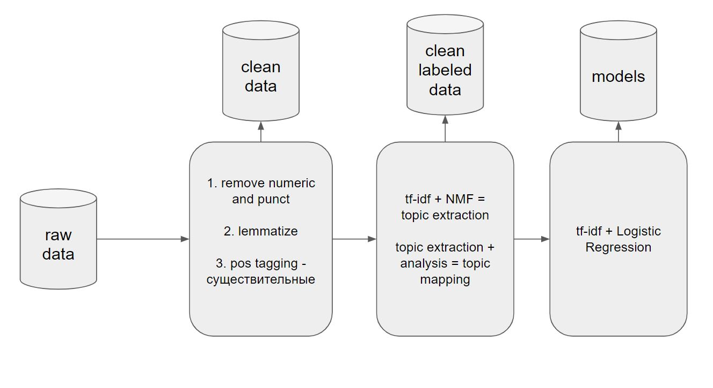

# Финальный проект по курсу Otus MLOps

## Тема: Классификация пользовательских обращений в техническую поддержку

Система технической поддержки крупных организаций сталкивается с множеством пользовательских запросов, которые варьируются по сложности, тематике и приоритету. Эти обращения часто неразмечены и содержат свободный текст, что затрудняет их автоматическую обработку и распределение между специалистами.

### Описание данных
Данные представляют собой неразмеченные текстовые обращения, которые могут включать запросы на устранение неполадок, жалобы, предложения по улучшению, вопросы по использованию продуктов и др.

### Проблема
Без предварительной разметки обращений обучить классификатор.

### Objective
Разработать систему автоматической разметки и классификации обращений, которая позволит:

- Улучшить роутинг обращений: автоматически назначать обращения на соответствующие отделы или специалистов, уменьшая время обработки.
- Разметка обращений для последующей аналитики
- Автоматическое расширение разметки: система должна автоматически адаптироваться к новым типам обращений, обучаясь на вновь поступающих данных.
- Интегрировать ее в существующую систему

## Бизнеc value
- Повышение эффективности работы службы поддержки: уменьшение времени обработки запросов за счет автоматизации.
- Снижение нагрузки на операторов: автоматическая классификация и маршрутизация запросов позволяет разгрузить операторов от рутинной работы.

## Структура репо
- **data/**: исходные данные
- **notebooks/**: EDA + pipeline, который лежит в основе проекта
- **sсrips/**: основные одиночные скрипты
  - **spark_pipeline/**: скрипты для препроцессинга, разметки, переразметки и обучения модели на spark
  - **py_pipeline/**: скрипты для препроцессинга, разметки, переразметки и обучения модели на python
  - **airflow_dags/**: даги для Airflow
- **src/**: исходный код сервиса Fast API
- **Dockerfile**: докерфайл для сервиса
- **k8s/**: манифесты для настройки работы сервиса в k8s
- **pyprojects.toml**: зависимости

## HLD
Основной пайплайн:

(п.1-3 оркестрируются в Airflow)

1. Препроцессинг данных с S3
2. Разметка данных
    * (автоматически) Разметка по предобученным моделям
    * (опционально) (полуавтоматически) Переобучение моделей разметки
3. Обучение классификатора, сохранение метрик и статтестов MLFlow
4. Обученная модель обернута в Fast API + Docker
5. По push в репо с изменением модели - github actions на пересборку контейнера
6. Собранный контейнер деплоится в k8s, где есть автомасштабирование
7. Продовые метрики отображаем в графане, стреляем алертами в тг

## Main ML ETL

1. Удаление числовых значений и пунктуации
2. Лемматизация
3. Часть речи (POS) теггинг — выделение существительных
4. Выделение топиков: TF-IDF + NMF (non-negative matrix factorization)
5. Классификация: TF-IDF + логистическая регрессия

## S3 buckets

`s3a://customer-sup-tickets-raw/` - исходные данные + логи airflow

`s3a://customer-sup-tickets-clean/` - оброаботанные данные; размеченные данные; скрипты для airflow, обученные модели

# Артефакты проекта
## ВМ для оркестрации через Airflow и версионирования экспериментов через MLFlow

## Препроцессинг, леблинг и обучениюч через Airflow + DataProc

## Метрики в MLFLow

## K8s deployments

## K8s pods

## Чекаем работоспособность сервиса в кубере

## Прометеус + графана для мониторинга

## Алерт в тг боте при превышении рейта по классификации топика Theft/Dispute reporting 

# Итоги

## Сделано:

- ETL на Spark с использованием DataProc в Yandex Cloud
- Оркестрация через DAG'и Airflow
- Метрики и статистические тесты в MLFlow
- Сервис на FastAPI в Docker-контейнере
- Деплой в Kubernetes
- Мониторинг через Prometheus и Grafana
- Алертинг в Telegram
- CI/CD через GitHub Actions

## Что можно улучшить:
- Перенос кластера из Kind в Yandex Cloud Kubernetes
- Автоматический анализ тем через GPT-4o или self-hosted LLM
- Интеграция Kafka для увеличения пропускной способности
- Подбор альтернативных ML-алгоритмов, эмбеддингов, и подходов для выделения тем

